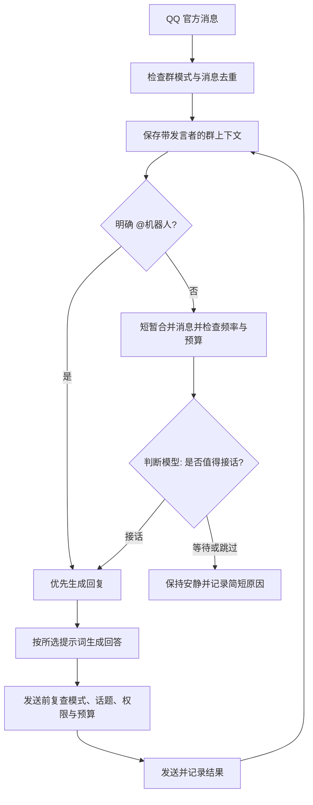

# 全能模式设计方案与实施记录

调研日期：2026-10-05。接入方式：继续使用 QQ 官方机器人，用户准备开通全量群消息权限。

用户已批准第一版第 1–3 步，并要求群消息保留 12 小时。已实现模式开关、多人上下文、批次判断、记忆与控制台；现有群默认轻量，实际全量事件投递和普通消息回复仍需开通官方权限后在群中验证。以下保留设计依据，并注明第一版边界。

## 目标与模式

全能模式的第一版目标：读取获准接收的全群消息，理解多人聊天，并按当前选中的提示词自行判断是否接话。它不会因为接收了每条消息就必须逐条回复。

模式按群选择，全局提供默认值；现有群默认继续使用轻量模式。控制台设置优先于群消息中的任何指令。

| 能力 | 轻量模式 | 全能模式第一版 |
|---|---|---|
| 普通群消息 | 不记录、不触发模型 | 进入有上限的群上下文 |
| @机器人 | 按当前用户的会话回复 | 优先处理，并参考近期群话题 |
| 非 @接话 | 关闭 | 合并消息后，模型选择接话或保持安静 |
| 多人上下文 | 每位用户分别保存 | 群消息带发言者、时间、引用关系，个人资料仍分别保存 |
| 长期记忆 | 当前的个人资料 | 个人资料 + 本群话题摘要，按来源管理 |
| 无新消息时主动开话题 | 关闭 | 独立开关，第一版默认关闭，另行验证发送权限 |
| 搜索、图片、语音、知识库 | 使用已支持的能力 | 后续按需增加独立开关 |

全量接收权限是平台能力；轻量 / 全能模式是本地行为。即使平台把普通消息推送过来，轻量群也会在记录和调用模型前过滤。

## 开源参考与取舍

1. [腾讯官方 Node SDK](https://github.com/tencent-connect/qqbot-nodejs/blob/main/src/protocol/gateway/event-dispatcher.ts)：当前项目使用的 1.0.4 已把 `GROUP_AT_MESSAGE_CREATE` 和 `GROUP_MESSAGE_CREATE` 解析为群消息。本地主要限制位于 `src/chat-service.js` 的非 @事件过滤，现有 `GROUP_AND_C2C` 订阅也已使用。方案继续复用该 SDK，实际事件投递仍需开通权限后验证。
2. [AstrBot](https://docs.astrbot.app/dev/astrbot-config.html)：借鉴群聊上下文感知、按会话启用和发言频率配置。
3. [AstrBot QQ 全量群消息适配插件](https://github.com/Wanyi424/astrbot_plugin_qq_restapi/blob/main/docs/full_group_reply_modes.md)：借鉴先保存上下文、再判断是否接话，以及判断模型与回复模型分工。该插件提供概率、智能判断等策略。本项目拟采用合并后的批次判断，避免每条消息都调用一次模型。
4. [MaiBot 模型分工](https://docs.mai-mai.org/en/manual/configuration/model-config) 与 [聊天时机](https://docs.mai-mai.org/faq/chat-and-reply)：借鉴 Planner 决定说话时机、Replyer 保持人格表达的分工，以及动态发言频率。第一版只规划“接话 / 等待 / 跳过”，不引入完整工具规划系统。

以下流程和参数是针对本项目的建议值，属于设计判断，不是这些项目的默认配置。继续复用 Node、SQLite、现有 API 配置和管理页面；实现时只借鉴结构，若使用第三方代码再核对其许可证。

## QQ 能力确认

接收全群消息、根据普通消息接话、没有新消息时主动推送需要分别验证。根据 [腾讯 SDK 发送说明](https://github.com/tencent-connect/qqbot-nodejs/blob/main/USAGE.md)，携带入站 `msgId` 与不携带 `msgId` 对应不同发送路径，主动路径受平台额度限制；不能用失效或无关的消息 ID 代替主动推送。

实施的第一步是在指定测试群确认：

- 普通文本实际到达 `GROUP_MESSAGE_CREATE`，并保留发言者、消息 ID 和时间。
- 全量模式下 @机器人是否仍有单独事件；如果只收到普通事件，就从 mentions 等字段识别真正 @自己的消息。不能把 @其他成员误判成 @机器人，也不依赖两种事件必须同时推送。
- 普通消息是否可作为有效的发送触发、真实发送窗口及限制是什么。
- 无触发消息的发送能力单独验证。能力不明时保持关闭，不套用社区流传的固定额度。
- 若现有 WebSocket 的实际投递不满足要求，再检查同一官方 SDK 的 Webhook 接入，结论以当前开放平台和实测为准。

界面显示“已检测到全量消息 / 尚未检测到 / 发送受限”等具体状态；尚未收到普通消息时，不直接断定权限缺失。

## 消息处理流程

消息收集与模型任务分开。群里新增消息时，先保留到有界缓存，不等待正在生成的回复结束。

### 收集与合并

- 消息用真实角色区分成员和机器人，保留成员 ID、可用昵称、消息 ID、时间、引用关系及是否 @机器人。昵称仅作展示，识别用户以平台标识为准。
- 同群按消息 ID 去重，覆盖重连重放、可能重复到达的不同事件；机器人发送回执与自发消息也只记录一次。
- 普通消息等约 2 秒静默再形成一批，最长等待 6 秒，防止连续热聊一直不处理。每批最多 10 条，多余消息保留在上下文并合入下一批。
- 每群最多一个生成任务。在途新消息进入下一批，@请求优先；普通接话任务不会挤占全部并发。
- 排队过多时合并或放弃旧的自动插话机会，保留近期上下文，不在群里反复发送“我很忙”。

### 决定是否发言

程序先检查模式、免打扰、频率与调用预算，再决定是否调用判断模型。普通候选批次由判断模型选择 `reply / wait / skip`，返回要回应的消息 ID 和一个简短理由；它不能指定跨群目标、改变权限或修改配置。

优先接话：有人叫角色名字、引用机器人追问、直接 @机器人、当前话题与刚才的回答明确相关，或有值得补充的群内求助。

倾向保持安静：成员之间的私人来回、已经有人回答的问题、重复刷屏、争吵升温、缺少上下文，以及 bot 刚刚说过话且没人继续问它。判断超时或返回无效结果时只保留上下文。

自然模式默认不随机漏掉整批候选；“省额”选项可进一步抽样。冷却期间不为普通消息调用判断模型，但仍保存上下文；明确 @请求使用独立优先路径。

### 生成与发送

- 判断与回复可以使用同一 API，也可以分别选便宜快速模型和更合适的聊天模型。判断阶段关闭搜索，限定短输出；回复阶段使用该群选中的提示词。
- 人格提示词与群聊数据分开。群成员的消息作为待理解的数据，不能通过“忽略规则”“切换模式”等聊天内容直接更改程序权限。
- 回答指定群中的一条或一组消息，区分当前发言者和被引用者。普通插话以短句为主，不为了装成人类而伪造经历或已经执行的操作。
- 发送前再次检查群是否仍为全能模式、任务是否已取消、目标消息是否有效、额度是否可用。遇到话题已经结束或明显变化的自动稿，放弃或最多重新判断一次，避免不停重算。
- 发送成功后记入群上下文；失败不把未送达内容当成已说过的话。网络超时导致结果不明时不自动重发，降低重复发送风险。
- 默认识别自身发送的消息 ID、平台提供的机器人标记和配置的其他 bot 标识。平台信息不足时无法保证识别全部机器人，群级冷却与发言上限继续约束互相触发。

## 上下文与记忆

群上下文改用真实多人时间线，不能把不同成员的话包装成同一个 user 的历史问答。第一版使用 SQLite 中独立的群消息与决策记录表，保留现有个人资料和轻量模式会话。

每次请求只读取相关窗口：最新群消息、短话题摘要、要回应的成员资料，以及必要的引用原文。不会一次把全群长期档案都塞进提示词。

长期记忆分为两类：

- **个人资料**：继续按群 + 成员隔离，从该成员自己的明确陈述归纳，保存事实来源消息 ID 与时间。引用、转述、玩笑和其他人替他作出的判断不直接写入。
- **本群话题摘要**：记录讨论过的主题、共同决定与尚未解决的问题，仅本群使用；有过期与清空入口。个人事实不自动升级为群共识。

旁听时也可整理有价值的陈述，不再以“bot 已成功回答五次”作为唯一触发条件。整理按批次、按来源成员进行，限频、限并发；显示“暂无新事实 / 已保存 / 整理失败”，提供手动整理入口。

群原文保留 12 小时，并受总正文容量限制；删除、清空或手动修改个人资料后，保存排除时间，避免旧群原文再次将它写回。第一版支持直接编辑 Markdown，尚未提供按单条事实管理来源的专用界面。全群文本会按需要进入用户选择的模型 API。

## 建议初始设置

| 设置 | 建议值 | 说明 |
|---|---|---|
| 默认模式 | 轻量 | 由用户逐群开启全能 |
| 第一版范围 | 全群文字 + 自主接话 | 图片、语音、工具能力后续独立扩展 |
| 群近期窗口 | 最近 60 条、最多 30 分钟 | 两个限制同时应用 |
| 单次回复上下文 | 最多 12000 字符 | 含摘要与成员资料，超限按优先级裁剪 |
| 消息合并 | 2 秒静默，最长 6 秒 | 明确 @请求可走优先路径 |
| 普通判断间隔 | 同群至少 15 秒 | 热聊期间最新批次替换旧批次 |
| 自主接话间隔 | 同群至少 30 秒 | 按用户希望更积极的要求调整；明确 @走优先路径 |
| 自主接话上限 | 同群每小时 24 次 | 直接调整数值，未提供三档预设 |
| 判断输出与超时 | 最多 128 tokens、8 秒 | 失败保持安静 |
| 自动回复输出 | 最多 256 tokens，普通闲聊 1–3 句 | 明确 @沿用现有生成长度限制 |
| 判断调用上限 | 同群每小时 120 次 | 上限不代表每小时必定调用这么多次 |
| 原文保留 | 12 小时，总正文 32 MiB | 查询过滤与每分钟清理；容量可调整 |
| 无新消息时开话题 | 默认关闭 | 单独验证官方主动发送能力后再开放 |

设置全局每日 tokens 上限（默认 200000）与各群份额，预算和小时计数持久化，重启不会绕过限制。第一版所有模型请求共享总预算，没有独立 @预留额度；用尽后 @和记忆整理也暂停新增调用，本地资料命令仍可用。未报告用量的调用保留保守预估，搜索等服务端续传可能让实际用量超出单次预估，下一次调用前会再检查额度。

这些值用于开始观察，适合程度需要用实际群活跃度验证。全能模式新增的主要开销是模型判断、群上下文 tokens 与记忆整理，不需要再带一套运行时；实际内存和费用在验收时测量，不先承诺固定数值。

## 管理界面

新增“群聊模式”页面：选择群、切换轻量 / 全能、设置发言活跃度、选择判断模型与回复模型、配置时间段和预算。

每群提供两种运行状态：

- **观察状态**：接收普通消息，显示它会不会接话和简短原因，不发送非 @自动回复；用于调参数，@请求正常处理。
- **发言状态**：允许判断通过的普通消息触发回复。

显示收到的普通消息数、判断次数、跳过原因、发言次数、发送失败、tokens 与整理结果。提供“暂停自主发言”“切回轻量”“清空群上下文”“整理一次”等入口。若要在群里开放管理命令，使用配置的管理员身份；人格中的“主人”称呼不授予管理权限。

观察记录只保留决策结果和简短原因，不要求模型输出内部思考过程。第一版群详情显示近期正文，尚未提供隐藏全文预览的单独开关。数据备份不带群原文、接话记录和话题摘要，以免备份长期保留这类临时数据；个人资料与预算仍备份。

## 实施顺序与验收

确认后按以下顺序实施，交付时默认仍为轻量模式：

1. **官方接入验证与模式开关**：支持普通事件、正确识别全量事件中的 @、按群配置、去重和接收状态。第一轮用观察状态检查真实消息字段。
2. **群上下文与自主接话**：建立多人消息窗口，加入批次判断、回复生成、群级串行任务和发送前复查；先在一群调试，再开放其他群。
3. **记忆、用量与管理**：批次提取个人事实和群摘要、来源追踪、忘记排除、持久预算与决策界面。
4. **可选扩展**：验证无新消息时的主动发送能力，按需加入图片、知识库、语音和工具。第四步不包含在第一版默认范围内。

预计改动现有 `bot.js`、`chat-service.js`、`runtime.js`、`settings.js`、`server.js`、记忆层及管理页面；新模块分别负责群上下文、批次调度、接话判断和发送策略。具体文件划分实施时确定。

必须验证：轻量群不保存普通消息；全量事件中的 @仍能正确回复；不同群与成员不串资料；同一消息只入库一次；高频连续消息可合并且队列有上限；判断失败时不自动发言；观察状态无自动发送；旧话题稿和已取消任务不发送；发送失败不形成虚假历史；自己发出的消息不引起连续自回复；切换模式 / 停止能取消待处理任务；重启保留预算、记忆和忘记记录。

原有 35 项本地测试继续通过；新增模拟普通群事件、多人引用、突发消息、预算和重启测试，再使用指定测试群验证官方投递与发送能力。

## 已批准的实施范围

第一版第 1–3 步已实施：QQ 官方接入、逐群轻量 / 观察 / 全能、全群文字上下文、自主接话、记忆来源和管理界面。群消息保留时间为 12 小时，回复风格由所选提示词决定。无消息主动开话题和多模态 / 工具扩展后续另行设计。

第一版的普通回复采用有效入站消息 ID；本地排队与发送检查使用保守的 4 分钟窗口，这不是对 QQ 平台实际时限的保证。切换模式与清空会取消尚未发出的任务；已经提交到平台的发送请求无法撤回。普通消息批次默认不抽样，省额抽样、管理员群内命令和备用模型尚未加入。

用户追加要求已加入：判断规则允许主动参与成员间的日常闲聊、共鸣、接梗和观点分享，不以提问为前提。控制台新增“加入当前话题”按钮，明确点击可跳过自动接话判断、免打扰和自动频率限制，仍遵守日预算、并发、取消和重复点击限制。最近消息可回复时复用有效 ID；较早的近期话题改走官方主动消息路径，发送能力以平台授权为准。该按钮不改变群模式，也不启动无消息自动开话题。
